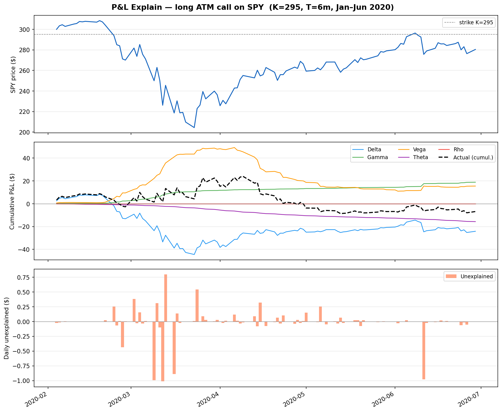
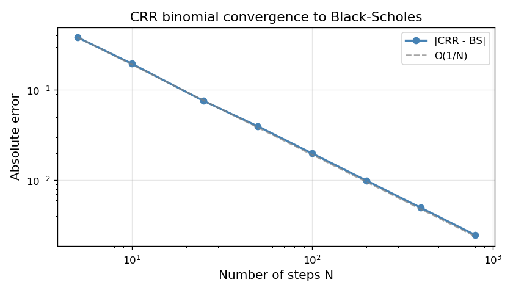

# Options Pricing Toolkit

Python library for pricing vanilla options and computing Greeks under two models:

| Model | European | American | Greeks |
|-------|----------|----------|--------|
| Black–Scholes (closed-form) | ✓ | — | Δ, Γ, ν, θ, ρ |
| CRR Binomial tree | ✓ | ✓ | — |

Includes an implied volatility solver, no-arbitrage validation, and a Greeks-based P&L explain engine.

---

## Installation

```bash
git clone https://github.com/mezaouifinance/options-pricing.git
cd options-pricing
pip install -e .
```

Requires Python ≥ 3.10 and NumPy ≥ 1.24.

---

## Quick start

```python
from optkit.bs import bs_price, bs_delta, bs_vega
from optkit.binomial import crr_price
from optkit.implied_vol import implied_vol

S, K, r, sigma, T = 100, 100, 0.03, 0.20, 1.0

# Black-Scholes
call  = bs_price(S, K, r, sigma, T, "call")     # 9.5768...
delta = bs_delta(S, K, r, sigma, T, "call")     # 0.5596...
vega  = bs_vega(S, K, r, sigma, T)              # 37.52...

# CRR binomial (European & American)
eu_put = crr_price(S, K, r, sigma, T, N=200, option_type="put")
am_put = crr_price(S, K, r, sigma, T, N=200, option_type="put", american=True)
assert am_put >= eu_put  # early-exercise premium

# Implied volatility (Newton + bisection fallback)
iv = implied_vol(call, S, K, r, T, "call")      # ~0.20
```

---

## P&L Explain

Decompose daily option P&L into Greek contributions (Δ, Γ, ν, θ, ρ) and an unexplained residual.

```python
from optkit.pnl import Position, MarketSnapshot, portfolio_pnl_explain

positions = [
    Position(strike=100, maturity=1.0, option_type="call", quantity=10, label="long call"),
    Position(strike=95,  maturity=0.5, option_type="put",  quantity=-5, label="short put"),
]

prev  = MarketSnapshot(spot=100.0, vol=0.20, rate=0.03)
today = MarketSnapshot(spot=101.5, vol=0.21, rate=0.03)

df = portfolio_pnl_explain(positions, prev, today)
print(df.round(4))
#             actual  delta  gamma   vega  theta    rho  unexplained
# long call   ...
# short put   ...
# TOTAL       ...
```

The unexplained residual captures higher-order terms not covered by a first-order Taylor expansion.

Run the demo on SPY during the COVID crash (Jan–Jun 2020):

```bash
pip install yfinance matplotlib
python scripts/pnl_explain_demo.py
```



---

## Run tests

```bash
pytest
```

---

## Run convergence study

```bash
python scripts/crr_convergence.py
```

Prints CRR error vs. N for a European call, illustrating O(1/N) convergence to Black-Scholes.

---

## Mathematical validation

### Put-call parity (no dividends)

```
C - P = S - K * exp(-rT)
```

Covered by `tests/test_bs.py`.

### No-arbitrage bounds (European, no dividends)

```
Call: max(0, S - K*exp(-rT)) <= C <= S
Put:  max(0, K*exp(-rT) - S) <= P <= K*exp(-rT)
```

Covered by `tests/test_noarb.py`.

### CRR convergence

CRR prices converge to the Black-Scholes closed-form as N increases.
Reproduce with `python scripts/crr_convergence.py`.



Error decays approximately as O(1/N) on the log-log scale, consistent with the theoretical rate.

---

## Project structure

```
options-pricing/
├── src/optkit/
│   ├── bs.py           # Black-Scholes price + Greeks (Δ Γ ν θ ρ)
│   ├── binomial.py     # CRR binomial tree
│   ├── implied_vol.py  # Newton + bisection IV solver
│   ├── pnl.py          # Greeks-based P&L explain
│   ├── noarb.py        # No-arbitrage bounds + put-call parity
│   ├── payoff.py       # Vanilla payoff
│   ├── types.py        # OptionType enum
│   └── utils.py        # norm_cdf, norm_pdf, discount_factor
├── tests/
│   ├── test_bs.py
│   ├── test_binomial.py
│   ├── test_implied_vol.py
│   ├── test_noarb.py
│   └── test_pnl.py
├── scripts/
│   └── crr_convergence.py
├── pyproject.toml
└── .github/workflows/ci.yml
```
